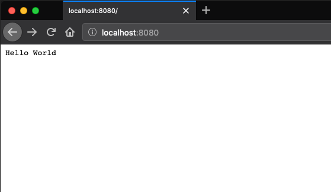

# Simple Dockerfile

## How to run

Compile the Go file. This is the example App which is a simple HTTP endpoint
```sh
go run main.go
```

Next you need to build the Dockerfile. You can do this by running the following command:
```sh
docker build -t simple-go .
```

After that you habe to run the Docker image by executing
```sh
docker run -it simple-go
```

Navigate to your browser and enter `localhost:8080`.



## Problems

As you saw during the setup of the docker image the whole process is rather cumbersome.
You have to compile the app every time you change something and <br>
if you use a Mac or a Windows machine you have to cross compile the app <br> to make it run on your machine.